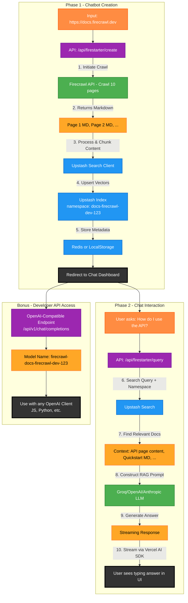

# Firestarter - Instant AI Chatbots for Any Website

<div align="center">
  
</div>

Instantly create a knowledgeable AI chatbot for any website. Firestarter crawls your site, indexes the content, and provides a ready-to-use RAG-powered chat interface and an OpenAI-compatible API endpoint.

## Technologies

- **Firecrawl**: Web scraping and content aggregation
- **Upstash Search**: High-performance vector database for semantic search
- **Vercel AI SDK**: For streaming AI responses
- **Next.js 15**: Modern React framework with App Router
- **Groq, OpenAI, Anthropic**: Flexible LLM provider support

[](https://vercel.com/new/clone?repository-url=https%3A%2F%2Fgithub.com%2Fmendableai%2Ffirestarter&env=FIRECRAWL_API_KEY,UPSTASH_SEARCH_REST_URL,UPSTASH_SEARCH_REST_TOKEN,GROQ_API_KEY&envDescription=API%20keys%20for%20Firecrawl,%20Upstash,%20and%20an%20LLM%20provider%20are%20required.&envLink=https%3A%2F%2Fgithub.com%2Fmendableai%2Ffirestarter%23required-api-keys)

## Setup

### Required API Keys

You need a key from Firecrawl, Upstash, and at least one LLM provider.

| Service          | Purpose                               | Get Key                                      |
| ---------------- | ------------------------------------- | -------------------------------------------- |
| Firecrawl        | Web scraping and content aggregation  | [firecrawl.dev/app/api-keys](https://www.firecrawl.dev/app/api-keys) |
| Upstash          | Vector DB for semantic search         | [console.upstash.com](https://console.upstash.com) |
| Groq             | High-speed LLM inference              | [console.groq.com/keys](https://console.groq.com/keys) |
| OpenAI           | Alternative LLM provider              | [platform.openai.com/api-keys](https://platform.openai.com/api-keys) |
| Anthropic        | Alternative LLM provider              | [console.anthropic.com/dashboard](https://console.anthropic.com/dashboard) |

### Quick Start

1. Clone this repository
2. Create a `.env.local` file with your API keys:
   ```
   FIRECRAWL_API_KEY=your_firecrawl_key
   
   # Upstash Vector DB Credentials
   UPSTASH_SEARCH_REST_URL=your_upstash_search_url
   UPSTASH_SEARCH_REST_TOKEN=your_upstash_search_token
   
   # Choose at least one LLM Provider (the first one found will be used)
   OPENAI_API_KEY=your_openai_key
   # ANTHROPIC_API_KEY=your_anthropic_key
   # GROQ_API_KEY=your_groq_key
   ```
3. Install dependencies: `npm install` or `yarn install`
4. Run the development server: `npm run dev` or `yarn dev`
5. Open [http://localhost:3000](http://localhost:3000)

## Example Interaction

**Input:**
A website URL, like `https://firecrawl.dev`

**Output:**
A fully functional chat interface and an API endpoint to query your website's content.

## How It Works

### Architecture Overview: From URL to AI Chatbot

Let's trace the journey from submitting `https://docs.firecrawl.dev` to asking it "How do I use the API?".



### Phase 1: Indexing a Website

1.  **URL Submission**: You enter a URL. The frontend calls the `/api/firestarter/create` endpoint.
2.  **Smart Crawling**: The backend uses the **Firecrawl API** to crawl the website, fetching the content of each page as clean Markdown.
3.  **Indexing**: The content of each page is sent to **Upstash Search**, which automatically chunks and converts it into vector embeddings.
4.  **Namespace Creation**: The entire crawl is stored under a unique, shareable `namespace` (e.g., `firecrawl-dev-1718394041`). This isolates the data for each chatbot.
5.  **Metadata Storage**: Information about the chatbot (URL, namespace, title, favicon) is saved in Redis (if configured) or the browser's local storage for persistence.

### Phase 2: Answering Questions (RAG Pipeline)

1.  **User Query**: You ask a question in the chat interface. The frontend calls the `/api/firestarter/query` endpoint with your question and the chatbot's `namespace`.
2.  **Semantic Search**: The backend performs a semantic search on the **Upstash Search** index. It looks for the most relevant document chunks based on the meaning of your query within the specific `namespace`.
3.  **Context-Aware Prompting**: The most relevant chunks are compiled into a context block, which is then passed to the LLM (e.g., Groq) along with your original question. The system prompt instructs the LLM to answer *only* using the provided information.
4.  **Streaming Response**: The LLM generates the answer, and the response is streamed back to the UI in real-time using the **Vercel AI SDK**, creating a smooth, "typing" effect.

### OpenAI-Compatible API: The Ultimate Power-Up

Firestarter doesn't just give you a UI; it provides a powerful, OpenAI-compatible API endpoint for each chatbot you create.

-   **Endpoint**: `api/v1/chat/completions`
-   **How it works**: When you create a chatbot for `example.com`, Firestarter generates a unique model name like `firecrawl-example-com-12345`.
-   **Integration**: You can use this model name with any official or community-built OpenAI library. Just point the client's `baseURL` to your Firestarter instance.

```javascript
// Example: Using the OpenAI JS SDK with your new chatbot
import OpenAI from 'openai';

const firestarter = new OpenAI({
  apiKey: 'any_string_works_here', // Auth is handled by your deployment
  baseURL: 'https://your-firestarter-deployment.vercel.app/api/v1/chat/completions'
});

const completion = await firestarter.chat.completions.create({
  model: 'firecrawl-firecrawl-dev-12345', // The model name for your site
  messages: [{ role: 'user', content: 'What is Firecrawl?' }],
});

console.log(completion.choices[0].message.content);
```
This turns any website into a programmatic, queryable data source, perfect for building custom applications.

## Key Features

-   **Instant Chatbot Creation**: Go from a URL to a fully-functional AI chatbot in under a minute.
-   **High-Performance RAG**: Leverages Firecrawl for clean data extraction and Upstash for fast, serverless semantic search.
-   **OpenAI-Compatible API**: Integrate your website's knowledge into any application using the familiar OpenAI SDKs.
-   **Streaming Responses**: Real-time answer generation powered by the Vercel AI SDK for a seamless user experience.
-   **Flexible LLM Support**: Works out-of-the-box with Groq, OpenAI, and Anthropic.
-   **Persistent Indexes**: Your chatbots are saved and can be accessed anytime from the index page.
-   **Customizable Crawl Depth**: Easily configure how many pages to crawl for deeper or quicker indexing.
-   **Fully Open Source**: Understand, modify, and extend every part of the system.

## Configuration

You can customize the application's behavior by modifying [`firestarter.config.ts`](firestarter.config.ts). When you run this repository locally, the crawling limits are increased.

```typescript
// firestarter.config.ts

const config = {
  // ...
  crawling: {
    defaultLimit: 10,
    maxLimit: 100, // Change this for your self-hosted version
    minLimit: 10,
    limitOptions: [10, 25, 50, 100],
    // ...
  },
  features: {
    // Public creation can be disabled for hosted read-only demos
    enableCreation: process.env.FIRESTARTER_DISABLE_CREATION_DASHBOARD !== 'true',
  },
  // ...
}
```

### Changing the LLM Provider

Firestarter supports multiple LLM providers and uses them based on a priority system. The default priority is **OpenAI (GPT-4o) → Anthropic (Claude 3.5 Sonnet) → Groq**. The system will use the first provider in this list for which it finds a valid API key in your environment.

To change the provider, simply adjust your `.env.local` file. For example, to use Anthropic instead of OpenAI, comment out your `OPENAI_API_KEY` and ensure your `ANTHROPIC_API_KEY` is set.

**Example `.env.local` to use Anthropic:**
```
# To use Anthropic instead of OpenAI, comment out the OpenAI key:
# OPENAI_API_KEY=sk-...

ANTHROPIC_API_KEY=sk-ant-...

# GROQ_API_KEY=gsk_...
```

This provider selection logic is controlled in [`firestarter.config.ts`](firestarter.config.ts). You can modify the `getAIModel` function if you want to implement a different selection strategy.

## Our Open Source Philosophy

Let's be blunt: building a production-grade RAG pipeline is complex. Our goal with Firestarter isn't to be a black box, but a crystal-clear, powerful foundation that anyone can use, understand, and contribute to.

This is just the start. By open-sourcing it, we're inviting you to join us on this journey.

-   **Want to add a new vector DB?** Fork the repo and show us what you've got.
-   **Improve the RAG prompt?** Open a pull request.
-   **Have a new feature idea?** Start a discussion in the issues.

We believe that by building in public, we can create a tool that is more accessible, affordable, and adaptable, thanks to the collective intelligence of the open-source community.

## License

MIT License - see [LICENSE](LICENSE) file for details.

## Contributing

We welcome contributions! Please feel free to submit a Pull Request.

## Support

For questions and issues, please open an issue in this repository.